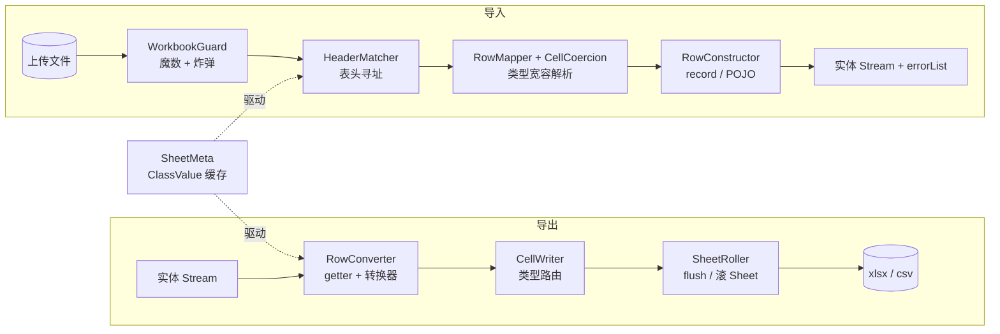

# SonicExcel 泡菜工厂图鉴

> 这份文档的目标只有一个：**让一个没读过这套代码的人，看完能讲清楚每一行数据是怎么进来、怎么出去的。**
>
> - 第一部分讲**架构与设计模式**——不打比方，只讲结构和"为什么是这个结构"。
> - 第二部分把整条流水线还原成一座**山东进货的韩国现代泡菜工厂**，每个工位都补上底层原理。
> - 第三部分跟一批**紫皮洋葱**走完全程：从加一个字段，到它出现在导出文件、模板下拉、导入报错里。
>
> 正式设计文档见 [SonicExcel-架构设计文档.md](SonicExcel-架构设计文档.md)。这份是它的"人话版"，两份内容一致，视角不同。

---

# 第一部分 · 架构视角

## 0. 一句话定位

SonicExcel 是一层**元数据驱动的双向映射引擎**：把 `@SonicTitle` 标注的 Java 类型编译成一份不可变的列描述（`SheetMeta`），然后用同一份描述同时驱动**导出、导入、模板生成**三条通道。底层引擎是 `org.dhatim:fastexcel`（拉模型 + 流式 zip），**整个项目不含 Apache POI**。

关键词是**对称**：一个 DTO 只标注一次，下载下来的模板就是能上传回去的模板。这不是巧合，是 `SheetMeta` 被读写两侧共用的必然结果（[SheetMeta.java:6](smart-admin-api/sa-base/src/main/java/sa/base/sonicexcel/meta/SheetMeta.java:6)）。

## 1. 分层

```
┌─────────────────────────────────────────────────────────────┐
│  Web 适配层   SmartExcelUtil        HTTP 协议防腐层           │
│               （落盘、删盘、探活、屏蔽 ClientAbortException） │
├─────────────────────────────────────────────────────────────┤
│  门面层       SonicExcel            唯一入口，5 个静态方法    │
│               SonicSheetBuilder / SonicSheetReader           │
│               SonicCsvWriter / SonicTemplateWriter           │
├─────────────────────────────────────────────────────────────┤
│  元数据层     MetaResolver → SheetMeta → ColumnMeta          │
│               SonicConverterFactory                          │
│               ★ 每个类只解析一次，之后永远走缓存 ★           │
├─────────────────────────────────────────────────────────────┤
│  引擎层       写：RowConverter → CellWriter → SheetRoller     │
│               读：WorkbookGuard → HeaderMatcher → RowMapper   │
│                                   → CellCoercion             │
├─────────────────────────────────────────────────────────────┤
│  底层         org.dhatim:fastexcel  +  JDK StAX              │
└─────────────────────────────────────────────────────────────┘
```

两条主干数据流：



注意那条虚线：**同一份 `SheetMeta` 同时挂在两条流水线上**。这是整个设计的支点。

## 2. 设计模式点名

不是为了凑数，每一条都写清楚"如果不用它会怎样"。

| 模式 | 落点 | 不用它会怎样 |
|---|---|---|
| **门面 Facade** | `SonicExcel`（[SonicExcel.java:25](smart-admin-api/sa-base/src/main/java/sa/base/sonicexcel/SonicExcel.java:25)） | 调用方要自己 new Workbook、自己关流、自己拼 Meta。收敛成一个类之后，"必须 try-with-resources"这种约束才有地方写 |
| **建造者 Builder + 流式配置** | `SonicSheetBuilder`、`SonicSheetReader` | 十几个可选参数只能靠重载爆炸或者一个 12 参构造器。而且 builder 能做"开写之后不许改配置"的状态校验（`ensureNotStarted()`） |
| **享元 / 惰性缓存** | `ClassValue<SheetMeta>`、`ClassValue<SonicConverter>` | 每导一次就反射解析一遍类。**注意这里刻意不用 `ConcurrentHashMap<Class,?>`**——那玩意持有 Class 强引用，是经典的类加载器泄漏源 |
| **策略 Strategy（代数数据类型形态）** | `sealed interface SonicErrorPolicy` + record 三兄弟 | 脏数据处置只能硬编码。做成 sealed 之后，`switch` 少写一个分支**编译不过**，新增策略时编译器会把所有遗漏点指给你 |
| **空对象 Null Object** | `SonicConverter.None` | 每个单元格都要 `if (converter != null)`。恒等实现让热路径没有分支 |
| **抽象工厂 + 依赖倒置** | `SonicConverterFactory`（Bean 优先，回退无参构造） | 转换器够不到 Spring 容器，字典翻译就只能继续手写在 service 里。**这是本框架相对 EasyExcel 最实质的差异点** |
| **适配器 / 防腐层 ACL** | `SmartExcelUtil`、`SonicSheetReader#translate` | 底层 `ExcelReaderException` 的 StAX 天书直接糊到用户脸上 |
| **卫兵 Guard** | `WorkbookGuard` | 摘掉 POI 之后"什么破文件都能读"的兜底没了，脏文件会在解析到一半时炸出无法诊断的异常 |
| **迭代器 + 管道（拉模型）** | `SonicSheetReader#doRead` 返回 `Stream<T>` | 只能一次性读进 List。拉模型意味着**消费者决定节奏**，配合 `Gatherers.windowFixed(1000)` 就能边读边入库 |
| **组合优于继承** | `RowConverter` 被 xlsx 和 CSV 两条通道共用 | 错误策略在两个地方各写一遍，然后慢慢长歪 |
| **模式匹配的类型路由** | `CellWriter#write` 的 `switch (value)` | 一长串 `instanceof` 链，加类型时容易漏 |

再补一条不在表里但更重要的：**flush 是一个背压点**。`SheetRoller` 每攒够 `flushEvery`（默认 1000）行就往 zip 流刷一次，堆里驻留的行数被钉死在常量级——这不是优化，这是"千万级导出不 OOM"这个承诺唯一的实现手段。

## 3. 三条不可协商的红线

这三条写错，功能"看起来正常"，但会在生产上以最难排查的方式炸掉。

1. **所有文本一律走 `inlineString`，禁止 `value(r, c, String)`**
   fastexcel 的 `Workbook` 没有关闭 shared strings 的开关，内部 `StringCache` 是一个无条件启用、永不清理的 HashMap。只要有一处调了 `value(String)`，那个字符串就永久驻留堆中。千万级高基数文本（订单号、地址、姓名）会直接把堆吃穿。代价是文件变大（重复文本不去重），换来的是**堆占用与数据量彻底解耦**。（[CellWriter.java:20](smart-admin-api/sa-base/src/main/java/sa/base/sonicexcel/write/CellWriter.java:20)）

2. **读侧入参只接受 `Path`，不接受 `InputStream`**
   解析 OOXML 需要 zip 随机访问。把 `InputStream` 交给 fastexcel-reader，它会用 `SeekableInMemoryByteChannel` 把整个 xlsx 读成堆里的 `byte[]`——100MB 的上传文件在读第一行之前就先吃掉 100MB **连续**堆内存。这种"假流式"从 API 层面掐断，比在文档里写一句提醒可靠得多。（[SonicExcel.java:43](smart-admin-api/sa-base/src/main/java/sa/base/sonicexcel/SonicExcel.java:43)）

3. **写侧必须 try-with-resources**
   xlsx 的 zip 中央目录是 `close()` 里最后写的。不关流 = 产出一个 Excel 打不开的文件，而且这个文件的字节数看起来完全正常。

---

# 第二部分 · 泡菜工厂图鉴

**原材料输入**：来自中国山东的卡车车队（用户上传的 Excel），满载未经处理的萝卜、白菜、芥菜、大葱、大蒜和辣椒（全是 String 形态的原始文本）。
**产品输出**：贴好标签、码放整齐的韩国现代泡菜罐头（Java 实体 / 导出文件）。

下面按货物流向逐个工位走。每个工位三段：**场景 → 框架映射 → 底层知识**。第三段才是认知增量，别跳。

---

## 工位 0 🚧 厂区大门保安亭 · `WorkbookGuard`

**场景**：卡车还没进厂区，保安先绕车一圈。有人开着拖拉机说自己是冷链车（`.xls` 改名成 `.xlsx`），有人拉了一车压缩到极限的脱水白菜——一泡水能涨满整个厂区（zip 炸弹）。

**框架映射**：进解析器之前先做四项体检——

| 体检项 | 阈值 | 代码 |
|---|---|---|
| 是不是老式 `.xls` | OLE2 头 `D0 CF 11 E0 A1 B1 1A E1` | 提示"请用 Excel 另存为 .xlsx" |
| 是不是 zip | `PK\x03\x04` | 不是就直接拒 |
| 解压后总量 | 200 MB | 超了拒绝解析 |
| 内部条目数 / 压缩比 | 1000 个 / 200:1 | 疑似压缩炸弹 |

**底层知识**：

- **绝不能靠文件扩展名判断格式**。用户把 `.xls` 改名成 `.xlsx` 是日常操作，不拦的话抛出来的会是一段不知所云的 zip/StAX 异常，客服完全没法回复。**魔数（magic number）在文件头几个字节，是格式的真身**，扩展名只是个昵称。
- `.xls` 的魔数 `D0CF11E0` 是 **OLE2 复合文档**格式——微软早年的"文件里的文件系统"，Word/Excel/PPT 老格式共用。`.xlsx` 则是一个**普通的 zip**，解开来是一堆 XML。
- **zip 炸弹**的原理：zip 的中央目录里记着每个条目的原始大小，攻击者可以用几十 KB 的文件声明自己解压后有几十 GB。解析器老老实实按声明分配缓冲区，服务就没了。防御手段不是"解压看看"，而是**在解压之前读元信息、算压缩比**。正常 xlsx 的压缩比在 10:1 上下，200:1 已经是明显异常。
- 有个细节容易漏：流式写出的 zip，中央目录里 `size` 可能是 `-1`。这种条目只能放过，交给解析器按流处理（[WorkbookGuard.java:89](smart-admin-api/sa-base/src/main/java/sa/base/sonicexcel/read/WorkbookGuard.java:89)）。

> **保安拦不住的**：WPS 等非 Excel 工具产出的 xlsx 是**合法 zip、正确魔数**，体检全过，只会在解析到一半时炸。本项目不承诺兼容这类文件，但 `translate()` 会把底层异常翻译成"请先用 Excel 打开并另存为 .xlsx 后重试"——**挡不住的东西，至少要让用户知道该怎么办**。

---

## 工位 1 🧊 冷链月台 · 为什么货必须先卸到地上

**场景**：司机说"我车上一直开着冷机，你直接从车厢里一根一根拿不行吗？"不行。因为**这批货的清单贴在车厢最里面的墙上**，你不先把车卸空、走到最里面，根本不知道车上有什么。

**框架映射**：`SonicExcel.read(Path, Class)` 只收落盘后的文件路径。Web 上传的 `MultipartFile` 由 `SmartExcelUtil` 负责落到 `${java.io.tmpdir}/sonic-excel/` 再交进来。

**底层知识**：

- **zip 的中央目录（Central Directory）在文件末尾**，不在开头。这是历史设计——zip 诞生于软盘时代，要支持跨盘分卷和追加写入，所以"目录"放最后。后果是：**读 zip 必须能 seek**，纯顺序的 `InputStream` 做不到。
- 所以任何"给我个 InputStream 就能流式读 Excel"的 API，背后必然在偷偷做一件事：把整个流读进内存变成可随机访问的 buffer。**它是流式的，但它不省内存**。这就是"假流式"。
- 临时文件的清理**不能用 `File#deleteOnExit()`**。它把文件名注册进 `DeleteOnExitHook` 的一个 static Set **永久持有**，且只在 JVM 正常退出时执行。K8s 里 Pod 被 SIGKILL / OOMKilled 时钩子根本不跑——**它想兜的底恰恰兜不住，运行期还持续漏内存**。
- 正确姿势是双保险：`finally` 删（管正常路径）+ **启动时扫描删 2 小时前的残留**（管 crash 路径）。文件统一放在自己的子目录，扫描只碰自己的东西（[SonicTempFiles.java:14](smart-admin-api/sa-base/src/main/java/sa/base/sonicexcel/SonicTempFiles.java:14)）。

---

## 工位 2 🚛 收货调度室 · 智能月台接线员 `HeaderMatcher`

**场景**：山东各个农场的送货单五花八门。有的写"大白菜"，有的写"胶州白菜"，还有的写"白菜 "——最后那个空格你根本看不见。更要命的是，有的司机把第 3 车厢和第 5 车厢的位置对调了。

**框架映射**：接线员手里一本《物料别名手册》（`@SonicTitle(alias={...})`）。他读一遍送货单，建一张「归一化名称 → 实际车厢号」的表，然后按工厂的物料清单去查，得到 `int[] positions`——第 i 位就是这一列在文件里的真实下标，`-1` 表示"这批货里没有"。

查找是**四级降级**的（[HeaderMatcher.java:51](smart-admin-api/sa-base/src/main/java/sa/base/sonicexcel/read/HeaderMatcher.java:51)）：

```
① 正式名精确匹配  →  ② 别名精确匹配  →  ③ 正式名忽略大小写  →  ④ 别名忽略大小写  →  -1
```

**底层知识**：

- **"火眼金睛"具体是什么**：`String#trim()` 和 `String#strip()` 都挡不住这三个字符——

  | 字符 | 码位 | 从哪来 | `Character.isWhitespace()` |
  |---|---|---|---|
  | 不间断空格 NBSP | `U+00A0` | 从网页复制粘贴的常客 | **false** |
  | 零宽不换行空格 BOM | `U+FEFF` | 文件编码头残留 | **false** |
  | 全角空格 | `U+3000` | 中文输入法直接打出来的 | **false** |

  三个全都"不算空白"，三个全都肉眼不可见。所以 `isBlankish()` 必须手动列举它们。代码里刻意用转义写法而不是字面量——**这三个字符在编辑器里是隐形的，写成字面量后没人看得出改动**（[HeaderMatcher.java:95](smart-admin-api/sa-base/src/main/java/sa/base/sonicexcel/read/HeaderMatcher.java:95)）。

- **alias 是刚需不是锦上添花**。中文表头改一个字，用户手里所有存量模板立刻全部导入失败。真实例子就在仓库里：`GoodsImportForm` 的商品状态列，正式表头是历史遗留的错别字 `"商品状态错误"`，用 `alias = "商品状态"` 兜住那些被人手工改对的模板（[GoodsImportForm.java:36](smart-admin-api/sa-admin/src/main/java/sa/admin/module/business/goods/domain/form/GoodsImportForm.java:36)）。

- **列顺序错乱为什么免疫**：因为映射是"按名字查下标"，不是"按位置读"。用户把列拖来拖去、在中间插一列广告，都不影响。多出来的列忽略，缺的列留空。

- **一列都对不上时直接抛**，不是留空跑完——那说明用户拿的根本不是这个模板，让他导入 5000 行空数据毫无意义。缺一部分列则只 warn（[SonicSheetReader.java:224](smart-admin-api/sa-base/src/main/java/sa/base/sonicexcel/read/SonicSheetReader.java:224)）。

---

## 工位 3 🗂️ 工艺档案室 · `MetaResolver`

**场景**：这是工厂里唯一一间"只在开工第一天忙"的屋子。第一批白菜进厂时，工程师在这儿花几十毫秒给"泡菜罐头"这个型号出一套完整工艺卡：几个格子、每格装什么、装料机械臂长什么样。**之后一千万罐都直接照卡执行，这间屋子再也不开门。**

**框架映射**：`MetaResolver.resolve(Class)` → `SheetMeta`。缓存用 `ClassValue`。

**底层知识**（这一站信息密度最高）：

### 3.1 为什么是 `ClassValue` 而不是 `ConcurrentHashMap<Class, SheetMeta>`

`Map<Class, ?>` 会**持有 Class 的强引用**。Class 引用它的 ClassLoader，ClassLoader 引用它加载的所有类——一个静态 Map 就能让整个应用的类加载器无法回收。热部署、多 war 部署下这是必炸的泄漏点。

`ClassValue` 是 JDK 专门为"给类挂缓存"设计的：值存在 `Class` 对象自己的槽位里，**类被卸载时值跟着走**，天然没有这个问题。顺带还免费拿到线程安全和"每个类只计算一次"的语义。

### 3.2 极速机械臂：`LambdaMetafactory`

传统做法是反射：`field.setAccessible(true); field.get(obj)`。每次调用都要走一遍 JVM 内部的访问检查和类型适配。

这里的做法是：在档案室里**当场为这个 DTO 生成一个字节码类**，把 `getGoodsName()` 编译成一个 `Function<Object,Object>`。调用点退化成普通的 `invokeinterface`，JIT 可以内联——**等同于你手写 `jar.setGarlic(garlic)`**。

几个关键细节：

- **为什么不是 `MethodHandle`**：从缓存字段里取出来的 MethodHandle 只能走 `invoke`（不是 `invokeExact`、不是 `static final` 常量），JIT 拿不到常量折叠，实测通常**不比 `setAccessible` 后的 Field 快**。MethodHandle 的性能优势严格依赖"调用点是 static final 常量"这个前提，而缓存在 Map 里的句柄不满足。
- **代价是每个访问器生成一个 hidden class**（JDK 15+ 的隐藏类，不占常规类空间但仍有元空间成本）。所以必须靠 `ClassValue` 保证**每个 DTO 只生成一次**。
- **`LambdaMetafactory` 只吃方法/构造器句柄，不吃字段句柄**。直接喂 `unreflectGetter` 会抛 `LambdaConversionException: Unsupported MethodHandle kind: getField`。所以没有 getter 的字段只能退回 MethodHandle 兜底（[MetaResolver.java:267](smart-admin-api/sa-base/src/main/java/sa/base/sonicexcel/meta/MetaResolver.java:267)）。实际业务 DTO 基本都有 Lombok 生成的 getter，走的是快路径。
- **装箱适配**：`instantiatedMethodType` 用包装类型声明（`box(valueType)`），让 LMF 自己插入装箱代码，不用手写。

> ⚠️ **诚实的性能账**：这条路径的真实价值是"**不用 `setAccessible`、不和将来的 JPMS 打架**"，不是"快 10 倍"。导出的瓶颈在 XML 序列化 + Deflate 压缩 + IO，属性访问占比不到 5%。这句话直接写在源码注释里（[MetaResolver.java:38](smart-admin-api/sa-base/src/main/java/sa/base/sonicexcel/meta/MetaResolver.java:38)）——**框架文档里最值钱的往往是这种"我们没那么快"的自我拆穿**。

### 3.3 出工艺卡时顺手做的三道校验

档案室不只是生成，还负责**在开工前把建模问题拦住**：

1. **基本类型拦截**（[MetaResolver.java:164](smart-admin-api/sa-base/src/main/java/sa/base/sonicexcel/meta/MetaResolver.java:164)）
   `int stock` 和 `Integer stock` 在导入缺列时天差地别：包装类型得 `null`（"这一列没填"），基本类型被**静默赋 0**（"库存是 0"）。业务上完全不是一回事，而且悄无声息。所以 dev/test/local profile 下直接抛异常，让这个问题在 CI 就红；生产环境降级为 WARN（[SonicExcelConfiguration.java:29](smart-admin-api/sa-base/src/main/java/sa/base/sonicexcel/SonicExcelConfiguration.java:29)）。

2. **index 全有或全无**
   要么全不写（按声明顺序），要么全写且构成 `0..n-1` 的**连续序列**。允许空洞的话表头行会出现空单元格，而空标题在导入侧无法寻址——与其让它半坏，不如直接拒绝。

3. **表头不许重复**
   两列同名，导入时按名字寻址必然二义。

---

## 工位 4 🧽 预处理车间 · 在编清洗机 `CellCoercion` + `SonicConverter`

**场景**：刚卸下来的大蒜带着泥，辣椒带着蒂。数字被写成了 `"1,000.50"`，日期被写成了 `"2026/8/9"`，状态列填的是"售卖中"三个字而不是数据库里的 `2`。

**框架映射**：分两条清洗线。

### 4.1 通用清洗线：`CellCoercion`

**核心取舍：不直接用 `Cell#asNumber()` 这类强类型取值器**。它们在类型不符时直接抛异常，而真实上传文件里「数字被存成文本」「日期被存成文本」**是常态**（用户粘贴、系统导出、WPS 另存都会这样）。

所以策略是**按目标类型走，三级降级**：

```
类型对得上 → 取原生值（cell.asNumber() / asDate() / asBoolean()）
类型对不上 → 退回文本解析（去千分位、试 7 种日期格式、认 是/否/√/×）
都失败     → 这一格才算坏了，扔残次品筐
```

细节里的世故：千分位同时处理半角 `,` 和**全角 `，`**；布尔值认 `是/否/y/n/√/×/对/错`（[CellCoercion.java:42](smart-admin-api/sa-base/src/main/java/sa/base/sonicexcel/read/CellCoercion.java:42)）。

### 4.2 定制清洗线：转换器

**在编员工，不是临时工。** 工厂绝不为每颗白菜雇一个工人——`SonicConverterFactory` 用 `ClassValue` 把每个转换器类**只实例化一次**，之后所有单元格共用这一台机器。

由此产生一条硬约束：

> **转换器实现类会被多线程并发调用，不得持有可变字段。**
> 但**允许注入 Spring 单例依赖**（`DictService` 这类本身线程安全的东西）。

**底层知识**：

- **Bean 优先、无参构造兜底**，这一条是 SonicExcel 相对阿里系唯一主动多做的设计。EasyExcel 的 Converter 靠反射无参构造实例化，**够不到 Spring 容器**——于是字典翻译只能一直手写在 service 里拼 VO。允许转换器是 Bean 之后，`@SonicTitle(converter = SonicDictConverter.class)` 才能真正把那段代码收走（[SonicConverterFactory.java:8](smart-admin-api/sa-base/src/main/java/sa/base/sonicexcel/converter/SonicConverterFactory.java:8)）。
- **转换器怎么拿到自己的参数**：实例是按类缓存的单例，参数不能存在实例字段里。所以 `SonicContext` 带上了 `AnnotatedElement element`——转换器从字段本身读 `@SonicDict("GOODS_PLACE")` 这类配置注解。注意**每个单元格都会访问一次**，所以转换器内部要自己按 element 缓存注解读取结果（`SonicDictConverter` 用了一个 `ConcurrentHashMap<AnnotatedElement, SonicDict>`）。
- **反查为什么不能现算**：标签 → 码走 `DictService#getDictDataValueByLabel`，底层是独立缓存。**不能用 `getAll()` 现查**——那是直连 DB，等于每个单元格一次全表读。
- **有歧义就报错，不猜**：同一字典下出现同名标签时直接抛异常。映射有歧义还硬映射，就是往库里写脏数据。

---

## 工位 5 🗑️ 残次品筐 · 错误模型 `SonicErrorPolicy`

**场景**：机器发现一颗烂心白菜。它**不会拉响警报停掉整个工厂**——把烂白菜扔进旁边的残次品筐，贴个条子：`第 3 车厢（行号）、白菜通道（列名）、原始值、白菜芯烂了（原因）`，然后继续洗下一颗。

**框架映射**：`sealed interface SonicErrorPolicy` 三个实现，做成密封接口是为了让 `switch` 被编译器检查完整性。

| 策略 | 行为 | 默认用在 |
|---|---|---|
| `FailFast` | 立即抛，异常带行号列名 | **导出** |
| `Collect(maxErrors)` | 收集继续跑，超 200 条熔断 | **导入** |
| `Skip` | 静默跳过，结束打一条汇总 | 明知脏的离线任务 |

**底层知识**：

- **默认值刻意不对称**，这是本框架最能体现"想过业务"的一处设计：
  - 导出默认 `FailFast`——**报表少了几行等于事故**，宁可整个失败也不能悄悄少数据。
  - 导入默认 `Collect(200)`——**用户就是会传脏数据**，一行坏了不该毁掉整批，但也绝不能静默丢掉。
- **为什么必须熔断**：千万行全脏时，一行一条日志能把磁盘写满。
- **初版设计里"warn 日志 + 跳过该行"这个唯一策略是不能接受的**：用户传 500 行、30 行被静默丢掉，界面只回一句"成功导入 470 条"，没人知道丢了谁。
- **残次品筐要能拿回去看**：`SonicExcel.writeErrorReport()` 把错误清单导成一个 xlsx 回给用户。500 行里 30 行有问题，与其在页面上堆一段被截断的文字，不如给一个能直接打开、逐条对照修改的文件——**这是导入体验的最后一环**。
- **写侧的一个精妙处**：`RowConverter` 先把整行的值**全部算出来再落笔**。因为一旦开始往输出流写，已写的单元格就撤不回来了——"某一列转换炸了要跳过整行"只有先算后写才成立（[RowConverter.java:19](smart-admin-api/sa-base/src/main/java/sa/base/sonicexcel/write/RowConverter.java:19)）。同理，`SheetRoller#prepareRow()` **只返回行号、不消费行位**，所以跳过一行不会在文件里留下空行。

---

## 工位 6 🤖 核心装配线 · 装罐 `RowMapper` + `RowConstructor`

**场景**：洗干净的白菜、萝卜和调料要塞进标准罐头。但罐头有两种型号，装法完全不同。

**框架映射**：`sealed interface RowConstructor` 三个分支——

| 罐头型号 | 装法 | 说明 |
|---|---|---|
| `PojoNoArg` | 先造空罐，再逐格 setter 塞 | 传统 POJO |
| `RecordCanonical` | 攒齐一整套料，**一次性**调 canonical 构造器 | record，不可变 |
| `Unavailable` | 这个型号只能出货、不能进货 | 只有 `@Builder` 没有无参构造的 DTO |

**底层知识**：

- **record 是一等公民**。EasyExcel 读侧靠无参构造 + setter 注入，**record 根本用不了**。SonicExcel 走 canonical 构造器，所以导入 DTO 可以是 record——而导入 DTO 本来就该是不可变的。
- **注解要标两个地方找**：`@SonicTitle` 的 `@Target` 必须同时包含 `FIELD` 和 `RECORD_COMPONENT`。只写 `FIELD` 的话，注解能否从 record 组件传播到合成字段是有条件的，解析端就得绕道 `getDeclaringRecord().getDeclaredField(name)`。一次写对，省掉一堆边界（[SonicTitle.java:20](smart-admin-api/sa-base/src/main/java/sa/base/sonicexcel/annotation/SonicTitle.java:20)）。
- **record 装罐前要先铺默认值**：`componentTypes` 必须完整带上，因为**没被 `@SonicTitle` 标注的组件也得填值**，而基本类型组件填 `null` 会让 `invokeWithArguments` 直接 NPE。
- **结构性问题在开读之前就报**：`RowMapper` 构造时就检查"POJO 少 setter""类没有无参构造"。不能等读到第 5000 行才每行抛一次一模一样的异常（[RowMapper.java:30](smart-admin-api/sa-base/src/main/java/sa/base/sonicexcel/read/RowMapper.java:30)）。
- **越界不算错**：`Row#getCell(int)` 在行比请求下标短时会抛 `IndexOutOfBounds`，而"最后几列全空所以这一行根本没那么多单元格"**是 xlsx 里最普通不过的形态**。所以统一走 `cellAt()`，越界返回 null。
- **空行必须过滤**：Excel 里被选中过、设过格式的行会以"看起来是空的"形态存在，成千上万行。不滤掉就会出现"导入了 3 条却提示处理了 5000 行"。

---

## 工位 7 📦 智能发货仓 · 防爆仓冷链调度 `SheetRoller`

**场景**：打包好的罐头如果全堆在车间里，工厂会被撑爆（OOM）。发货主管定了铁律：**车间最多放 1000 罐**，一到数就发车进地下冷库。无论山东运来 10 万吨还是 1000 万吨，运转大厅里永远只有 1000 罐。

**框架映射**：`SheetRoller` 管三件事，**每一件不做就等于没做**。

### 7.1 flush —— 防 OOM 的实际开关

fastexcel 的 `Worksheet` 在 `flush()` 之前，**所有 cell 都攒在内存里**。不 flush 的"流式写"和一次性写占用**一模一样**。

底层约束：**flush 只能顺序向前**。所以行号必须单线程分配——这就是为什么 `prepareRow()` 是整条写链路唯一的行位分配点。

### 7.2 滚 Sheet —— 千万级导出成立的前提

**xlsx 单表硬上限 1,048,576 行**（含表头）。这是 OOXML 规范定死的，不是实现限制。不换 Sheet 的话"千万级导出"根本不成立。

换表时对旧表调 `finish()`，它内部会 `rows.clear()` 把那一整张表的行数组**释放掉**——这一步才是内存真正回收的地方。

### 7.3 列宽 —— 一个只有一次机会的窗口

fastexcel 只有 `ws.width(col, w)`，**没有 auto-size**。不处理的话中文列全是 `####`。

但约束是硬的：**`<cols>` 这段 XML 在第一次 flush 时一次性写出，之后再调 `width()` 没有任何效果**。

于是策略变成一场赛跑：

```
采样前 100 行（SAMPLE_ROWS）估算宽度
  ├─ 采样满了 → 立刻落宽度
  └─ 没满但要 flush / finish 了 → 强制落
```

采样上限（100）**必须远小于 flushEvery（1000）**，否则第一批还没采完就已经写出去了。这两个常量之间存在的是**隐式耦合**，改任何一个都要回头看另一个（[ColumnWidths.java:26](smart-admin-api/sa-base/src/main/java/sa/base/sonicexcel/write/ColumnWidths.java:26)）。

中文按 2 个字符宽计算（`charAt(i) > 0xFF`）。自动估算的宽度会加 2 的余量并钳制在 `[8, 60]`；但**显式写了 `@SonicTitle(width=12)` 就原样是 12，既不补余量也不钳制**——用户明确指定的东西被框架偷偷改掉，是最难排查的那类问题。

---

## 工位 8 🏷️ 标签打印机 · `CellWriter`

**场景**：往罐头上贴标签。看着简单，坑最密集。

**框架映射**：`switch (value)` 模式匹配做类型路由。三条特殊规则：

### 8.1 数值精度：15 位分水岭

手机号、身份证、订单号、雪花 ID 写成数值，Excel 会显示成 `1.38E+10`——**导出组件的经典投诉**。

底层原因：Excel 单元格的数值用 **IEEE 754 双精度浮点**存储，能精确表示的十进制有效位数是 **15 位**。超过就必然失真，不是显示问题，是存储问题。

所以：整数类超过 15 位数字 → **改写成文本**。`Double`/`Float` 不干预——它们本来就是浮点，科学计数是预期显示。

### 8.2 单元格 32767 字符上限

超出会产出一个 **Excel 打不开的文件**。所以必须截断，并计数上报（`truncatedCount`）。

### 8.3 公式转义：一个反直觉的默认值

`escapeFormula` **默认关闭**，这是深思后的选择：

- 本框架所有文本都写成 `inlineStr`，**Excel 对文本型单元格根本不做公式求值**，注入面在 xlsx 内几乎不存在。
- 而默认开启会把 `+8613800000000` 这类**合法手机号**改成 `'+8613800000000`。

结论：**用确定发生的数据污染，换取几乎不存在的收益，是负收益**。真要防"用户另存为 CSV 再打开"的场景时，显式打开它（[SonicSheetBuilder.java:108](smart-admin-api/sa-base/src/main/java/sa/base/sonicexcel/write/SonicSheetBuilder.java:108)）。

---

## 工位 9 ✈️ 空运通道 · `SonicCsvWriter`

**场景**：真·千万级的订单，走冷链集装箱太慢了——xlsx 光 Deflate 压缩就是分钟级，生成的文件 Excel 打开还要几十秒。这时候走散装空运：CSV。

**取舍表**：

| | xlsx | CSV |
|---|---|---|
| 行数上限 | 1,048,576/表 | 无 |
| CPU | Deflate 压缩，分钟级 | 几乎不耗 |
| 样式/多 sheet | 有 | 无 |
| 数字 | 真数值 | 全是文本 |

**底层知识**：

- **UTF-8 BOM 那三个字节 `EF BB BF` 不能省**。不写的话 Excel 打开中文 CSV 就是乱码——**CSV 导出被投诉最多的一件事**。Excel 在没有 BOM 时会按系统 ANSI 代码页猜编码，中文 Windows 上就是 GBK，于是 UTF-8 的中文全变问号。只有确认下游是程序而不是 Excel 时才该关掉。
- **RFC 4180 转义规则**：含分隔符、引号、换行的字段整体加引号，内部引号翻倍（`"` → `""`）。
- `BigDecimal` 必须用 `toPlainString()`，否则大数会写成科学计数，下游再读就错了。
- **两条通道共用 `RowConverter`**，所以同一个 DTO 既能导 xlsx 也能导 CSV，注解写一份。行号也对齐（都从 1 起，0 是表头），错误信息里的行号在两边说的是同一回事。

---

## 工位 10 📋 空白订货单 · `SonicTemplateWriter`

**场景**：与其等山东那边填错了再退货，不如**一开始就给他们一张填不错的订货单**——品种那一栏是个下拉框，只有这几个选项，想填别的都填不进去。

**框架映射**：`SonicExcel.writeTemplate()` 产出「表头 + 可选示例行 + 下拉校验」。下拉选项来自 `@SonicOptions`，可以是字面量，也可以是 `provider`（枚举、字典动态生成）。

**底层知识**：

- **下拉是防脏数据最划算的一招**：用户根本填不出非法值，比事后报错强得多。成本几乎为零——数据有效性只是一段 XML。
- **Excel 内联下拉的 `formula1` 有 255 字符硬上限**，超了文件会被判定损坏。所以超长时只能放弃下拉并 WARN，不能硬写。
- **选项里不能含逗号和引号**，否则会把 `formula1` 撕开。含了就过滤掉并 WARN。
- 下拉作用 5000 行，给足用户往下拖的余量。
- **provider 让模板不会漂移**：`GoodsImportForm` 的状态列用 `SonicEnumOptionProvider` 从 `GoodsStatusEnum` 生成选项——**枚举加一项，模板跟着变**，不会出现"代码改了模板没改"。

---

## 工位 11 ⚡ 厂区电力总闸 · `SonicStaxIsolation`

**场景**：工厂新装了一台德国进口的高效电机（`aalto-xml`）。它自带一个坏毛病：**接上电就把整个厂区的电压标准改成它自己的**。结果隔壁的包装机、监控系统、冷库温控全都跟着变了行为，而且是在你完全不知情的情况下。

**框架映射**：`fastexcel-reader` 依赖 `com.fasterxml:aalto-xml`，后者 jar 里带着 `META-INF/services/javax.xml.stream.*`。一旦进入 classpath，**全 JVM 的 `XMLInputFactory.newFactory()` 都会返回 Aalto**。

实测本项目 214 个 runtime jar 中，摘掉 POI 后仍有 6 个会走 SPI 查找：`spring-core`、`spring-web`、`hibernate-validator`、`mysql-connector-j`、`tika-core`，以及 **`aws-query-protocol`（S3 客户端解析响应和错误走的就是它）**。

**底层知识**：

- **Java SPI（`META-INF/services`）是全局单例式的服务发现**：谁的 jar 在 classpath 里声明了实现，谁就赢。这是一种**隐式的、无声的全局副作用**——你只是加了一个 Excel 依赖，却改掉了整个 JVM 的 XML 解析器。这类问题在依赖升级时最常发生，且极难归因。
- **为什么拨回 JDK 实现是安全的**：`fastexcel-reader` 自己有一个 `DefaultXMLInputFactory`，直接 `new com.fasterxml.aalto.stax.InputFactoryImpl()`，**压根不走 SPI**。所以把 SPI 拨回 JDK 不影响它自身的解析性能。
- **落地方式是双层**：主路径是 JVM 参数（运维可见、可摘、可回滚），`SonicStaxIsolation` 只做兜底——**已经被外部设置过的属性不会被覆盖**。
- ⚠️ **一个极易写错、且写错不会立刻暴露的地方**：`XMLEventFactory` 的 JDK 实现类在 **`.events.` 子包**下（`com.sun.xml.internal.stream.events.XMLEventFactoryImpl`），另外两个不在。写错了启动完全正常，要等某个组件**首次使用** `XMLEventFactory` 才抛 `FactoryConfigurationError`——典型的"上线三天后随机报错"（[SonicStaxIsolation.java:29](smart-admin-api/sa-base/src/main/java/sa/base/sonicexcel/SonicStaxIsolation.java:29)）。所以启动时会做自检并打日志。

---

## 工位 12 🧹 厂区值班表 · 启动时的三件事

`SonicExcelConfiguration` 是 SonicExcel 与 Spring 的**唯一接线点**，动作刻意放在**构造器**里而不是 `@Bean` 方法——StAX 隔离要尽可能早生效，而配置类的实例化早于绝大多数业务 Bean。

开工三件事：

1. `SonicStaxIsolation.install()` —— 合上电力总闸
2. `SonicConverterFactory.setBeanFactory(...)` —— 把 Spring 容器交给清洗机调度
3. `SonicTempFiles.sweepStale(2h)` —— 扫掉上次崩溃残留的临时冷库

然后打一条日志，把严格模式状态和 StAX 自检结果都写出来。**自检只报告、不抛异常——自检本身不该有能力搞挂启动。**

---

# 第三部分 · 紫皮洋葱：一次变更的完整旅程

山东那边突然送来一批极其罕见的**紫皮洋葱**。我们要在泡菜罐头上新增一个格子装它。

## Step 0 · 加一个格子

```java
public record GoodsImportForm(
        @SonicTitle("商品分类") String categoryName,
        @SonicTitle("商品名称") String goodsName,
        @SonicTitle(value = "商品状态错误", alias = "商品状态")
        @SonicEnum(GoodsStatusEnum.class)
        @SonicOptions(provider = SonicEnumOptionProvider.class)
        String goodsStatus,
        @SonicTitle("产地") String place,
        @SonicTitle("商品价格") BigDecimal price,

        // ★ 新增：紫皮洋葱专用格子
        @SonicTitle(value = "洋葱品种", alias = {"洋葱种类", "品种"})
        @SonicOptions({"紫皮", "白皮", "黄皮"})
        String onionVariety,

        @SonicTitle("备注") String remark
) {}
```

**就这一处。没有第二处。** 不用改导出代码、不用改导入代码、不用改模板生成代码、不用改错误处理。这就是"元数据驱动"这四个字的兑现方式。

## Step 1 · 编译期发生了什么

什么都没发生。注解是 `RUNTIME` 保留的，编译器只检查 `@Target` 合法——`RECORD_COMPONENT` 在列表里，通过。

## Step 2 · 启动期发生了什么

也什么都没发生。`MetaResolver` 是**惰性**的：`ClassValue.get()` 第一次被调用时才解析。启动时只有电力总闸和临时文件清扫。

## Step 3 · 第一次调用 —— 档案室开门（只此一次）

第一个用户点了"下载模板"，`MetaResolver.resolve(GoodsImportForm.class)` 触发：

```
① 判类型：是 record → 走 collectFromRecord()
② 遍历 7 个 RecordComponent，逐个找 @SonicTitle
   （组件上找不到就去合成字段上再找一次，两头都找最稳）
③ 校验一：有没有基本类型字段？
   onionVariety 是 String，安全通过。
   ★ 如果你手滑写成 int onionCount，dev/test/local 下这里直接抛异常，
     CI 就红了——而不是等某天生产上出现一条"洋葱数量 = 0"的脏数据
④ 校验二：index 全有还是全无？全都没写 → 按声明顺序，洋葱排第 6 列（下标 5）
⑤ 校验三：表头重复吗？"洋葱品种"是新的，通过
⑥ 为每一列生成极速机械臂：
   LambdaMetafactory 把 onionVariety() 编成一个 Function<Object,Object>
   （record 的访问器就是 onionVariety()，不是 getOnionVariety()）
⑦ 生成装罐机：RecordCanonical(canonical 构造器句柄, 7 个组件类型)
⑧ 打包成 SheetMeta，塞进 GoodsImportForm.class 的 ClassValue 槽位
```

**耗时几十毫秒，之后一千万次调用都是一次 `ClassValue.get()`。**

## Step 4 · 模板下载 —— 订货单自动多了一栏

`SonicTemplateWriter` 遍历 7 列，走到洋葱列时：

1. 写表头 `洋葱品种`，加粗
2. 算列宽：`"洋葱品种"` 4 个中文 = 8 个显示宽度，+2 余量 = 10，在 `[8,60]` 内 → 10
3. 读 `@SonicOptions`，拿到 `["紫皮","白皮","黄皮"]`
4. 检查：不含逗号引号 ✅；拼成 `"紫皮,白皮,黄皮"` 共 13 字符 < 255 ✅
5. 在 `B2:B5001` 挂上数据有效性，`showDropdown(true)`，错误提示"请从下拉列表中选择"

**用户拿到的模板，洋葱那一栏是个下拉框。他填不出"紫色洋葱"这种东西。**

## Step 5 · 导出 —— 出货单自动多了一栏

`RowConverter` 遍历 7 列，走到洋葱列：

```java
Object raw = col.getter().apply(row);   // 极速机械臂：等同于 row.onionVariety()
values[5] = col.converter().exportConvert(raw, ctx);  // None 恒等，原样返回
```

然后 `CellWriter` 看到是 `String` → 走 `text()` → `inlineString` 落笔。列宽由前 100 行采样决定。

## Step 6 · 导入 —— 三种真实剧本

### 剧本 A：用户用的是新模板

`HeaderMatcher` 读表头，建表 `{"商品分类":0, ..., "洋葱品种":5, "备注":6}`，`positions[5] = 5`。
`CellCoercion.toJavaType(cell, String.class)` → 归一化后的文本。
装罐时 `args[5] = "紫皮"`，canonical 构造器一次性造出对象。**完美。**

### 剧本 B：用户用的是**上周下载的旧模板**（没有洋葱列）

这是最常见的真实情况。

```
HeaderMatcher 查 "洋葱品种" → 精确匹配失败
              查 alias "洋葱种类" / "品种" → 失败
              查忽略大小写 → 失败
              → positions[5] = -1
```

然后：
- `SonicSheetReader#readHeader` 发现 `missing = ["洋葱品种"]`，不是全部缺失 → **只打一条 WARN，继续跑**
- `RowMapper#cellAt(row, -1)` → 返回 `null`
- `CellCoercion` → `null`
- 装罐时 `values[5] == null`，**跳过赋值**，`args[5]` 保持 `CellCoercion.defaultValue(String.class)` = `null`

**结果：旧模板照样能导入，洋葱字段是 `null`。**

`null` 在业务上明确表示"这一列没填"，service 层可以据此决定是报错还是给默认值。
👉 **而如果你当初把这个字段写成了 `int`，这里得到的是 `0`——一个看起来完全合法、实际是凭空捏造的值。这就是工位 3 那道校验存在的全部意义。**

### 剧本 C：用户手工改过表头，写成了"品种"

`alias = {"洋葱种类", "品种"}` 兜住。**第二级降级命中。**

如果当初没写 alias，这一列就静默留空——用户填了数据，系统假装没看见。**这是 alias 必须在第一天就写好的原因。**

### 剧本 D：某一行填了"红皮"（下拉被用户绕过了）

如果这一列挂了字典/枚举转换器，转换失败 → 抛异常 → `RowMapper` 捕获 → 交给 `sink`：

```
SonicRowError(rowIndex=42, title="洋葱品种", rawValue="红皮", message="「红皮」不是字典 ... 中的合法取值")
```

按默认的 `Collect(200)` 策略：这一行被跳过，`skippedRows++`，**其余 4999 行照常导入**。
结束后 `SonicExcel.writeErrorReport()` 把这批错误导成一个 xlsx 回给用户，他打开就能看到"第 43 行，洋葱品种，红皮，不是合法取值"。

---

## 附录 A · 工厂角色 ↔ 代码速查表

| 工位 | 类 | 文件 |
|---|---|---|
| 🚧 大门保安 | `WorkbookGuard` | [read/WorkbookGuard.java](smart-admin-api/sa-base/src/main/java/sa/base/sonicexcel/read/WorkbookGuard.java) |
| 🧊 冷链月台 | `SonicTempFiles` / `SmartExcelUtil` | [SonicTempFiles.java](smart-admin-api/sa-base/src/main/java/sa/base/sonicexcel/SonicTempFiles.java) |
| 🚛 收货调度室 | `HeaderMatcher` | [read/HeaderMatcher.java](smart-admin-api/sa-base/src/main/java/sa/base/sonicexcel/read/HeaderMatcher.java) |
| 🗂️ 工艺档案室 | `MetaResolver` → `SheetMeta` / `ColumnMeta` | [meta/MetaResolver.java](smart-admin-api/sa-base/src/main/java/sa/base/sonicexcel/meta/MetaResolver.java) |
| 🧽 通用清洗机 | `CellCoercion` | [read/CellCoercion.java](smart-admin-api/sa-base/src/main/java/sa/base/sonicexcel/read/CellCoercion.java) |
| 🧽 定制清洗机 | `SonicConverter` / `SonicConverterFactory` | [converter/](smart-admin-api/sa-base/src/main/java/sa/base/sonicexcel/converter/SonicConverterFactory.java) |
| 🗑️ 残次品筐 | `SonicErrorPolicy` / `SonicRowError` | [error/SonicErrorPolicy.java](smart-admin-api/sa-base/src/main/java/sa/base/sonicexcel/error/SonicErrorPolicy.java) |
| 🤖 装罐机 | `RowMapper` / `RowConstructor` | [read/RowMapper.java](smart-admin-api/sa-base/src/main/java/sa/base/sonicexcel/read/RowMapper.java) |
| 📦 发货仓 | `SheetRoller` / `ColumnWidths` | [write/SheetRoller.java](smart-admin-api/sa-base/src/main/java/sa/base/sonicexcel/write/SheetRoller.java) |
| 🏷️ 标签打印机 | `CellWriter` | [write/CellWriter.java](smart-admin-api/sa-base/src/main/java/sa/base/sonicexcel/write/CellWriter.java) |
| ✈️ 空运通道 | `SonicCsvWriter` | [write/SonicCsvWriter.java](smart-admin-api/sa-base/src/main/java/sa/base/sonicexcel/write/SonicCsvWriter.java) |
| 📋 空白订货单 | `SonicTemplateWriter` | [write/SonicTemplateWriter.java](smart-admin-api/sa-base/src/main/java/sa/base/sonicexcel/write/SonicTemplateWriter.java) |
| ⚡ 电力总闸 | `SonicStaxIsolation` | [SonicStaxIsolation.java](smart-admin-api/sa-base/src/main/java/sa/base/sonicexcel/SonicStaxIsolation.java) |
| 🧹 值班表 | `SonicExcelConfiguration` | [SonicExcelConfiguration.java](smart-admin-api/sa-base/src/main/java/sa/base/sonicexcel/SonicExcelConfiguration.java) |

## 附录 B · 关键常量一览

| 常量 | 值 | 在哪 | 为什么是这个值 |
|---|---|---|---|
| `flushEvery` | 1000 | `SonicSheetBuilder` | 防 OOM 的实际开关 |
| `maxRowsPerSheet` | 1,000,000 | `SonicSheetBuilder` | xlsx 硬上限是 1,048,575 |
| `SAMPLE_ROWS` | 100 | `ColumnWidths` | **必须远小于 flushEvery** |
| `MAX_CELL_CHARS` | 32767 | `CellWriter` | 超出产出打不开的文件 |
| `MAX_EXACT_DIGITS` | 15 | `CellWriter` | IEEE 754 双精度的十进制精度 |
| `MAX_INLINE_OPTIONS_LENGTH` | 255 | `SonicTemplateWriter` | Excel `formula1` 上限 |
| `maxRows`（读） | 100,000 | `SonicSheetReader` | 防单文件拖死服务 |
| `Collect(maxErrors)` | 200 | `SonicErrorPolicy` | 熔断，防日志写满磁盘 |
| `MAX_IN_MEMORY_BYTES` | 5 MB | `SonicExcel#readBytes` | 内存逃生口的硬上限 |
| `MAX_UNCOMPRESSED_BYTES` | 200 MB | `WorkbookGuard` | zip 炸弹防线 |
| `MAX_COMPRESSION_RATIO` | 200:1 | `WorkbookGuard` | 正常 xlsx 约 10:1 |
| `DEFAULT_STALE_AGE` | 2 小时 | `SonicTempFiles` | 比任何合理导入都长 |

---

## 最后一句

这套框架真正的设计重心**不在性能**——源码注释里自己承认了，`LambdaMetafactory` 那条路带来的属性访问提速在总耗时里占比不到 5%。

它的重心在**把所有"会静默出错"的地方变成"要么不出错、要么明确报错"**：
基本类型在启动期就拦、表头空白字符在匹配前就洗、脏数据进筐而不是进日志、`.xls` 在门口就拦、SPI 劫持在开机就拆、临时文件在崩溃后还有人扫。

**山东的卡车永远会送来带泥的白菜。工厂的水平不体现在它能洗多快，而体现在它遇到烂白菜时，能不能准确地告诉你是第几车厢的哪一颗。**
