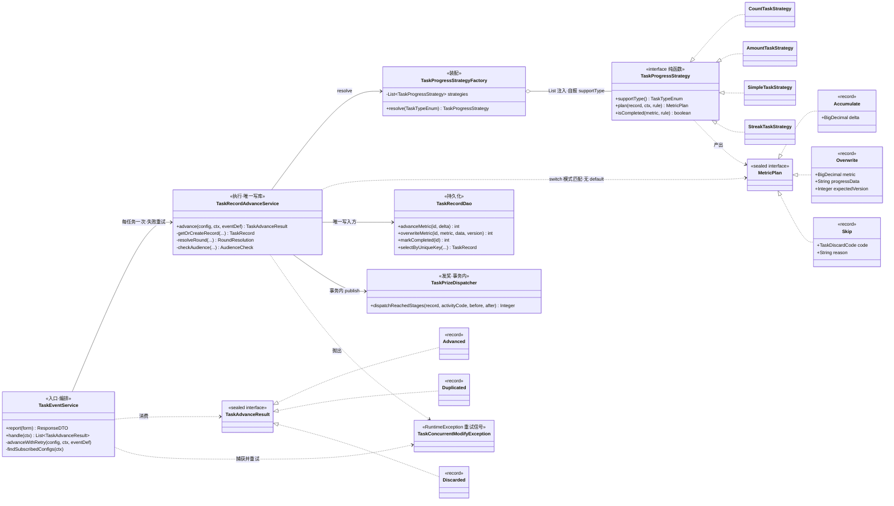
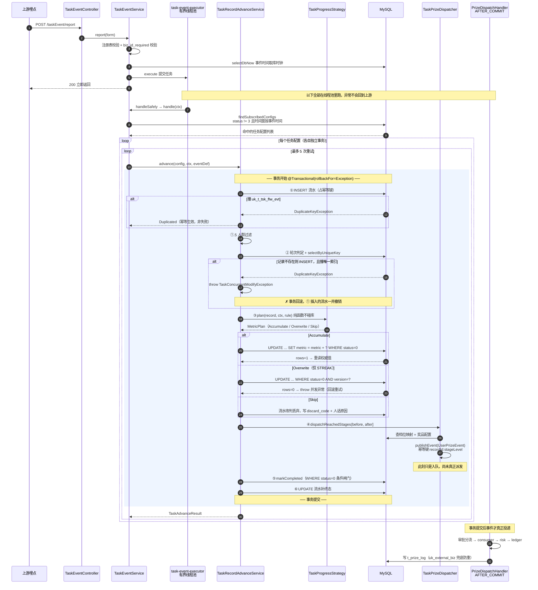

# 任务引擎核心运转与排雷白皮书

> 面向接手人 · 2026-08-03
> 覆盖范围：`sa-marketing` 的 `net.lab1024.sa.task.runtime` 包（事件入口 → 策略 → 推进 → 发奖）
>
> **本文的每一条结论都对着当前代码复核过，并标了文件与行号。**
> 凡是"我记得当初是这样设计的"与代码不一致的地方，**以代码为准** —— 这份文档写的是
> 现在跑在库上的那套逻辑，不是当初的设计意图。前置阅读：`docs/营销中台-会话交接文档.md` §0 铁律。

---

## 0. 三十秒建立上帝视角

```
上游埋点 ──POST /taskEvent/report──▶ TaskEventService（校验 + 规范化，不写业务库）
                                          │  submit 到有界线程池，立即返回
                                          ▼
                              findSubscribedConfigs：谁订阅了这个事件
                                          │  每个任务配置一条独立链路
                                          ▼
                    advanceWithRetry ──▶ TaskRecordAdvanceService.advance()   ★ 唯一写业务库的地方
                        （最多 5 次）        │  一个任务 = 一个事务
                                          ├─▶ TaskProgressStrategy.plan()  纯函数，算出 MetricPlan
                                          ├─▶ 按 MetricPlan 执行 SQL（累加 / 乐观锁覆写 / 丢弃）
                                          └─▶ TaskPrizeDispatcher 投 UserPrizeEvent（事务内 publish）
                                                          │
                                            AFTER_COMMIT ─┴─▶ 既有派奖链路 consumer→risk→ledger
```

四个必须先记住的事实：

| # | 事实 | 违反后的症状 |
|---|---|---|
| 1 | **`t_task_record_flow` 是这条链路唯一的可观测面** | 异步 + AFTER_COMMIT 让异常不再上抛，不查这张表就只能猜 |
| 2 | **`advance()` 是唯一写业务库的方法** | 策略里偷偷写库 = 并发语义散落各处，出问题无法定位 |
| 3 | **每个任务配置一个独立事务** | 一个坏配置会把同一批的其它任务一起回滚 |
| 4 | **重试必须换新事务** | 就地重试永远是同一个结果（§3 详解） |

---

## 1. 顶层设计：为什么是这个形状

### 1.1 计算与执行的劈裂：策略为什么被剥夺了写库权

`TaskProgressStrategy`（[strategy/TaskProgressStrategy.java:25](../smart-admin-api-java17-springboot3/sa-marketing/src/main/java/net/lab1024/sa/task/runtime/strategy/TaskProgressStrategy.java#L25)）
的契约只有一句话：**给我记录、事件、规则，你告诉我"该怎么推"，但你不许自己推。**

```java
MetricPlan plan(TaskRecord record, TaskEventContext ctx, TaskRuleConfig rule);
```

四个实现（COUNT / AMOUNT / SIMPLE / STREAK）全都不查库、不写库、不读 `LocalDateTime.now()`
（时间一律从 `ctx.eventTime()` 取）。这不是洁癖，是三个具体收益：

**① 并发语义只有一处。**
如果让策略自己写库，四个策略就会各写一套更新 SQL。而"怎么更新"恰恰是这个模块**最难、最容易写错**的部分——
`advanceMetric` 是条件更新原子累加，`overwriteMetric` 是乐观锁覆写，两者的并发含义天差地别。
散到四处，早晚有人把 COUNT 写成"读出来 +1 再写回去"，那就是教科书式的 Lost Update：
两个并发事件各读到 3，各写回 4，用户点了两次只涨了一次。
现在这两条 SQL 各自只有一份（[TaskRecordDao.java:84/95](../smart-admin-api-java17-springboot3/sa-marketing/src/main/java/net/lab1024/sa/task/record/dao/TaskRecordDao.java#L84)），
想写错都没地方写。

**② 策略可以纯函数单测。**
没有数据库、没有 Spring 上下文，`plan()` 输入输出都是值对象。断档清零那个经典的 off-by-one
（[StreakTaskStrategy.java:62](../smart-admin-api-java17-springboot3/sa-marketing/src/main/java/net/lab1024/sa/task/runtime/strategy/StreakTaskStrategy.java#L62)：
断档是"归零再 +1"而不是"归零"，因为断档当天本身也是有效的一次）能被一个不到 10 行的单测钉死。
如果它埋在一段带事务的写库逻辑里，验证成本会高一个数量级，实际结果就是没人写测试。

**③ "累加型"和"读-改-写型"的差别被抬到了类型上。**
这是最关键的一点，见下一节。

> ⚠️ 一条容易被忽视的推论：**`plan()` 拿到的 `record` 是快照，不是权威值。**
> `Accumulate` 分支执行完 UPDATE 后必须重新 `selectById` 取回 `current_metric`
> （[TaskRecordAdvanceService.java:154](../smart-admin-api-java17-springboot3/sa-marketing/src/main/java/net/lab1024/sa/task/runtime/TaskRecordAdvanceService.java#L154)），
> 因为条件更新拿不到结果值。**不要图省事写成 `record.getCurrentMetric().add(delta)`** ——
> 并发下那是错的，而且错得很隐蔽（发奖档位会算歪）。

### 1.2 新语法的降维打击：sealed + record 到底替我们挡住了什么

`MetricPlan` 是一个**代数数据类型（ADT）**：一个封闭的和类型，恰好三个变体。

```java
public sealed interface MetricPlan {
    record Accumulate(BigDecimal delta) implements MetricPlan {}
    record Overwrite(BigDecimal metric, String progressData, Integer expectedVersion) implements MetricPlan {}
    record Skip(TaskDiscardCode code, String reason) implements MetricPlan {}
}
```

消费端（[TaskRecordAdvanceService.java:140](../smart-admin-api-java17-springboot3/sa-marketing/src/main/java/net/lab1024/sa/task/runtime/TaskRecordAdvanceService.java#L140)）
用 switch 模式匹配**解构**它，注意：**没有 `default` 分支**。

```java
switch (plan) {
    case MetricPlan.Skip(TaskDiscardCode code, String reason) -> { ... }
    case MetricPlan.Accumulate(BigDecimal amount) -> { ... }
    case MetricPlan.Overwrite(BigDecimal metric, String progressJson, Integer expectedVersion) -> { ... }
}
```

它系统性规避的，是这三类**只在线上才暴露**的 bug：

| 传统写法的坑 | ADT 如何堵死 |
|---|---|
| **新增分支忘了改消费端。** 加个 `Decrement` 类型，`if-else`/`default` 会把它悄悄归到某个兜底分支，编译通过、运行错得无声 | `sealed` 让编译器知道变体是穷尽的；没有 `default` 时**漏掉任何一个变体直接编译不过**。加分支这件事从"靠人记得"变成"编译器逼你" |
| **状态非法组合。** 传统写法常见一个大 DTO：`{type, delta, metric, version, reason}`，于是 `type=Accumulate` 却带着 `version` 的对象在系统里流动，谁也说不清该信哪个字段 | 每个变体**只携带自己需要的字段**。`Accumulate` 里根本没有 `version` 这个概念，非法组合在类型层面无法表达 |
| **必填项被写成"可选"。** `Skip` 若把 `code` 设计成可空，一定会有实现只写 `reason` 图省事，最后大屏上多出一堆归不了类的丢弃 | `code` 是 record 的必填分量，**忘了分类就编译不过**（[MetricPlan.java:56](../smart-admin-api-java17-springboot3/sa-marketing/src/main/java/net/lab1024/sa/task/runtime/domain/MetricPlan.java#L56) 的注释就是这个意思） |

`TaskAdvanceResult`（Advanced / Duplicated / Discarded）同理。这里还藏着一个语义设计：
**`Duplicated` 不是失败**。上游重投、MQ 重复消费是常态，幂等命中恰恰说明防重在工作——
把它做成独立变体而不是塞进 `Discarded`，是为了让上层不可能把"防重生效"误报成"处理失败"而触发告警。

`record` 的另一半价值是**不可变**。`MetricPlan` 一旦产出就不会再被谁"顺手改一下"，
它从策略传到执行层的路上语义是稳定的。这条在第 5 节会变成一条红线。

### 1.3 类图



> 🔴 **注意工厂那条 `o--`：是 `List` 注入 + 各实现自报 `supportType()`，不是 `Map<Enum, Strategy>`。**
> 本项目已因"枚举键 Map 用字符串 get"踩过**三次**静默失效（`GlobalEventDispatcher` /
> `PrizeStrategyFactory` / `AssetStrategyFactory`），三次症状一样：`Map.get(Object)` 不做类型检查，
> 编译通过、运行恒 null、异常还被上层 catch 吞掉。
> 所以 `resolve()` **只接受 `TaskTypeEnum`，故意不提供 `resolve(String)` 重载**
> ——让"拿字符串来查"在编译期就无处安放。工厂构造时还做了重复 `supportType` 自检，
> 重复注册直接启动失败，而不是让后注册的那个永远收不到事件。

---

## 2. 核心战役：`advance()` 的生死 6 步

全在 [TaskRecordAdvanceService.java:82-196](../smart-admin-api-java17-springboot3/sa-marketing/src/main/java/net/lab1024/sa/task/runtime/TaskRecordAdvanceService.java#L82)。
整个方法在**一个** `@Transactional(rollbackFor = Exception.class)` 里。

### 第 ① 步：先插流水，占住幂等键

```java
TaskRecordFlow flow = buildFlow(config, ctx);
try {
    taskRecordFlowDao.insert(flow);
} catch (DuplicateKeyException e) {
    return new TaskAdvanceResult.Duplicated(ctx.eventBizId());   // 幂等生效，不是错误
}
```

**顺序不能调。** 先推进度再补流水，会在两步之间留下一个窗口：进度加了但没留痕，
此时重投会重复累加。撞 `uk_t_tsk_flw_evt (task_config_id, member_name, event_biz_id)`
就是"这个事件对这个任务已经处理过"，直接返回 `Duplicated`。

注意这个唯一索引**带 `task_config_id`**：一个 `ORDER_PAID` 可能同时命中"累计消费满 500"和"下单 3 次"两个配置，
它对每个配置都该各生效一次。

### 第 ①.5 步：人群过滤

配了 `target_audience` 但上游没告知 `isNewMember` 时——**丢弃，不是放行**
（[:248](../smart-admin-api-java17-springboot3/sa-marketing/src/main/java/net/lab1024/sa/task/runtime/TaskRecordAdvanceService.java#L248)）。
放行等于"配了人群但对所有人生效"，运营看不出任何异常，直到有人问"为什么老会员也领到新人礼"——
那时奖已经发出去了。而取值**非法**（既不是 NEW 也不是 OLD）时反而放行 + `log.warn`：
为一个配错的枚举把用户进度卡住不划算，但要留痕。这两个分支的取向不同，别统一。

### 第 ② 步：轮次判定 + 取或建记录

`resolveRound()` 处理 `limit_count`（本周期可参与几轮）：最新一轮还在进行中就继续推它，
已完成则开下一轮（`periodKey#2`、`#3`…），轮次用满则丢弃。只有 DAILY / WEEKLY 受轮次限制。

然后 `getOrCreateRecord()` ——**本文第 3 节整节在讲这里的一行 `throw`**。

拿到记录后立刻检查 `status`：不是"进行中"就丢弃。

### 第 ③ 步：策略纯计算 + 按 plan 执行 SQL

```java
MetricPlan plan = strategy.plan(record, ctx, rule);
switch (plan) {
    case Skip       -> 落丢弃流水，结束
    case Accumulate -> advanceMetric(id, delta)  →  rows==0 意味着「记录已不可推进」，丢弃，不重试
    case Overwrite  -> overwriteMetric(id, metric, json, version)  →  rows==0 抛 TaskConcurrentModifyException，重试
}
```

**🔴 两个 `rows == 0` 的语义完全不同，别抄错：**

- `advanceMetric` 的 `WHERE id=? AND status=0`——rows=0 只可能是**状态已流转**（已完成/已发奖），
  这是终局，重试多少次都一样，所以落丢弃流水；
- `overwriteMetric` 的 `WHERE id=? AND status=0 AND version=?`——rows=0 大概率是**版本被别人改了**，
  这是**可恢复**的，所以抛异常让外层换事务重来。

把这两个搞混，前者会变成无意义的重试风暴，后者会把真正的并发冲突静默吞掉。

### 第 ④ 步：阶梯发奖

`dispatchReachedStages(record, activityCode, before, after)` 按 `(before, after]` 窗口找出本次跨过的档位，
每档 `publishEvent(UserPrizeEvent)`。

**🔴 幂等键是 `recordId:stageLevel`**（[TaskConst.java:232](../smart-admin-api-java17-springboot3/sa-marketing/src/main/java/net/lab1024/sa/task/constant/TaskConst.java#L232)）。
只传 `recordId` 的话，`t_prize_log.uk_external_biz` 是单列全局唯一，
`PrizeDispatchHandler` 靠 `catch(DuplicateKeyException)` 防重——
**阶梯任务第二档会被当成重复投递静默吞掉，零并发下必现。**

另外注意窗口判定只是**优化，不是判据**：真正防重复发奖的是那个唯一索引。
窗口在并发下可能算得不精确，多算了会被索引挡下。**判据只留一个**——两个判据一定会漂移。

### 第 ⑤ 步：达标闸门

```java
boolean completed = strategy.isCompleted(after, rule) && isHighestStageReached(config, highestReached);
if (completed) {
    if (taskRecordDao.markCompleted(record.getId()) > 0) {   // WHERE status = 0，条件更新做闸门
        taskRecordDao.markDispatched(record.getId());
    }
}
```

`status=1 已完成` 的语义是**最高档达标**。阶梯任务里"第 1 档已发、第 2 档进行中"必须留在 `status=0`,
否则 `advanceMetric` 的 `WHERE status=0` 会把后续事件全挡住——表现是**"拿了第一档奖之后任务就再也不动了"**。

### 第 ⑥ 步：流水补齐终态

把 `flow_type=1`、`delta_metric`、`after_metric` 回填进第 ① 步那条流水。
这一步让 `t_task_record_flow` 成为可对账的完整账本：每条流水都能回答"这次推了多少、推完是多少"。

### 时序图



**三处必须看懂的边界：**

1. **HTTP 响应边界在 `execute` 之后**——上游拿到 200 只代表"我收下了"，不代表任务推进成功。
   唯一的失败返回是**队列打满被拒**（`AbortPolicy`），那是留给上游的重试信号，并且会落一条
   `POOL_REJECTED` 的丢弃流水——选了 AbortPolicy 就必须让丢弃可查。
2. **事务边界严格包住 ①~⑥**，`publishEvent` 在事务**内**调用。
   `@TransactionalEventListener(AFTER_COMMIT)` 的机制是：**没有事务上下文，事件根本不会投递**。
   彩票派奖那次就是这么表现为"记录都标成已投递了，但下游一条都没收到"。
3. **重试循环在事务外**（`advanceWithRetry` 里），所以每次尝试都是**全新事务**。这不是风格问题，
   是正确性问题——下一节。

---

## 3. 🔴 深水区：`getOrCreateRecord` 为什么必须抛异常，而不能就地重查

你读到的这段是对的，一字不差：

```java
private TaskRecord getOrCreateRecord(TaskConfig config, TaskEventContext ctx, String periodKey) {
    TaskRecord existing = taskRecordDao.selectByUniqueKey(...);   // ← 快照读
    if (existing != null) return existing;
    TaskRecord record = buildRecord(...);
    try {
        taskRecordDao.insert(record);
        return record;
    } catch (DuplicateKeyException e) {
        throw new TaskConcurrentModifyException("任务记录已被并发创建，换新事务重试...");
    }
}
```

**没有就地重查。**这是实测踩出来的，不是理论洁癖：10 并发只推进了 1 笔，另外 9 笔全抛 `DuplicateKeyException`。

### 3.1 幽灵现象还原

设两个事务 T1、T2 同时为同一个 `(member, config, period)` 处理事件：

```
时刻  T1                                   T2
 t1   BEGIN
 t2   SELECT ... 没有 → null              BEGIN
 t3                                       SELECT ... 没有 → null
 t4   INSERT 成功（持有行锁，未提交）
 t5                                       INSERT → 阻塞（等 T1 的唯一索引锁）
 t6   COMMIT
 t7                                       解除阻塞 → 抛 DuplicateKeyException
 t8                                       ★ 如果此处「就地重查」…
 t9                                       SELECT ... 依然是 null ！！
```

**t9 就是那个幽灵：INSERT 明明报了"重复"，转头一查却查不到。**

看起来自相矛盾，其实两句话读的**根本不是同一份数据**：

- `SELECT`（不加锁）是**快照读**，读的是 T2 那份**一致性视图**里的版本；
- `INSERT` 的唯一性校验是**当前读**——它必须看**索引上最新已提交的真实状态**，否则唯一约束就形同虚设。

T1 是在 t6 才提交的，而 T2 的视图在 **t3 那次 SELECT** 时就已经定格了。
T1 插入的那一行**不在 T2 的快照里**，重查一万次也还是 null。

> 讽刺之处在于：**"捕获 DuplicateKeyException 后就地重查"这个到处都能见到的写法，
> 只在"记录早已存在"时成立，而在"刚刚被并发创建"时失效——而后者恰恰是它被写出来要解决的那个场景。**

### 3.2 底层原理：ReadView 与快照读的边界

**MySQL InnoDB 默认隔离级别是 REPEATABLE READ（RR）。**MVCC 的实现要点：

**每行有两个隐藏列**：`DB_TRX_ID`（最后修改它的事务 id）和 `DB_ROLL_PTR`（指向 undo log 的指针）。
一行被反复修改就形成一条**版本链**，链上每个节点是一个历史版本。

**ReadView（一致性视图）**是一个快照结构，含四个关键字段：

| 字段 | 含义 |
|---|---|
| `m_ids` | 创建视图那一刻，**仍然活跃（未提交）**的事务 id 集合 |
| `min_trx_id` | `m_ids` 中的最小值 |
| `max_trx_id` | 系统下一个将要分配的事务 id |
| `creator_trx_id` | 创建这个视图的事务自己的 id |

**可见性判定**（沿版本链从新到旧走，直到找到第一个可见版本）：

- `DB_TRX_ID == creator_trx_id` → 自己改的，**可见**；
- `DB_TRX_ID < min_trx_id` → 视图创建前就已提交，**可见**；
- `DB_TRX_ID >= max_trx_id` → 视图创建后才开始的事务，**不可见**；
- 落在区间内：在 `m_ids` 里 → 当时还没提交，**不可见**；不在 → 当时已提交，**可见**。

**🔴 关键就是 ReadView 的生成时机：**

| 隔离级别 | ReadView 何时生成 |
|---|---|
| **REPEATABLE READ** | **本事务第一次快照读时生成一个，之后整个事务复用它** |
| READ COMMITTED | **每一条 SELECT 语句都重新生成一个** |

注意 RR 下**不是 `BEGIN` 时生成**，而是**第一次读**时（除非显式
`START TRANSACTION WITH CONSISTENT SNAPSHOT`）。这正好解释了我们的现象：
T2 的视图定格在 t3 那次 `selectByUniqueKey`，T1 在 t6 才提交，
它的 `DB_TRX_ID` 对 T2 而言永远落在"不可见"那一侧。**这一整个事务的生命周期里，T2 都看不到那一行。**

**快照读 vs 当前读**——这是理解全局的分水岭：

| 类型 | 语句 | 读的是什么 |
|---|---|---|
| **快照读** | 普通 `SELECT` | ReadView 决定的历史版本，**不加锁** |
| **当前读** | `SELECT ... FOR UPDATE` / `LOCK IN SHARE MODE` / `UPDATE` / `DELETE` / `INSERT` | **最新已提交版本**，并加锁 |

所以同一个事务里"`INSERT` 说有、`SELECT` 说没有"完全不矛盾——**它们分属两个世界**。
顺带说明另一件事：为什么第 ③ 步 `advanceMetric` 这种 `UPDATE ... SET x = x + ?` 天然无冲突——
UPDATE 本身就是当前读 + 行锁，读到的一定是最新值。

### 3.3 架构权衡：为什么不是加锁读

改成 `SELECT ... FOR UPDATE` 确实能 work（当前读看得到最新已提交版本）。没选它，四个理由：

**① 决定性理由：那条流水必须被回滚掉。**
这是**本模块特有**、跟 MVCC 无关的一条，也是最重要的一条。回看第 ① 步——
**流水是先于进度推进落库的**（幂等键要先占位）。如果就地重查后继续往下走并正常返回，
事务会提交，**那行流水就留下了**。而这次推进其实是在一个"半截状态"上完成的。
更糟的是另一种写法：如果就地重查失败后返回一个"请稍后重试"的结果对象，事务照样提交，
流水照样留下——**下一次重试立刻撞唯一索引被判成"已处理"，进度永远推不上去**，
而外部看起来一切正常（事件收到了、流水也有）。

抛异常让 `rollbackFor = Exception.class` 把**流水和记录一并回滚**，重试时幂等键可以重新占位。
这是"抛异常"相对"返回错误码"的**硬优势**，不是风格偏好。
（这段推理原样写在 [TaskConcurrentModifyException.java:14-22](../smart-admin-api-java17-springboot3/sa-marketing/src/main/java/net/lab1024/sa/task/runtime/TaskConcurrentModifyException.java#L14)。）

**② 为一个纯读场景引入行锁，而且锁的是别人刚插入的行。**
`FOR UPDATE` 会给那行加 X 锁，持锁直到事务结束——而我们后面还要做发奖、查配置等一串操作，
锁的持有时间被拉长到整个事务。首次接取是并发最集中的时刻，等于在最热的点上串行化。

**③ 撞索引失败后事务的状态是"脏"的。**
INSERT 唯一键冲突时，InnoDB 会在冲突行上留下锁（RR 下典型是 S 锁/next-key 锁），
这是经典的死锁来源——两个事务各自插入、各自冲突、各自持有对方要的锁。
在这样一个事务里继续做加锁读，是在已经不干净的状态上继续叠加。

**④ "换个事务重试"不只是重来一次，更是为了拿到新快照。**
这条值得单独记住：新事务 = 新 ReadView，而**就地循环重试多少次都是同一个结果**。
这也正是 `TaskRecordAdvanceService` 必须是**独立 Bean** 的又一条硬理由——
自调用不走代理，"新事务"就无从谈起。

**代价也要说清楚**：这条路会浪费一次已完成的部分工作（流水插了又回滚），并占用重试预算。
所以重试次数 `MAX_RETRY_ATTEMPTS = 5` 是**算过的**：首次接取时 N 个并发里只有 1 个能建成记录，
其余 N-1 个都靠第 2 次尝试命中（那时记录已提交，`selectByUniqueKey` 直接返回）——
**绝大多数冲突两次就收敛**，5 是留给 STREAK 乐观锁连续冲突的余量。
而且刻意**不做退避**：冲突窗口只有"读→写"之间的几毫秒，退避只会拉长整体耗时。

---

## 4. 并发排雷指南：防范快照幻读的 4 把武器

场景抽象成一句话：**"并发写冲突之后，我需要拿到那条刚被别人写进去的最新数据。"**

### 武器 1：当前读 `SELECT ... FOR UPDATE`

```java
catch (DuplicateKeyException e) {
    return taskRecordDao.selectByUniqueKeyForUpdate(...);   // 当前读，看得到
}
```

| | |
|---|---|
| ✅ | 改动最小，一行 SQL；语义直白；不需要外层配合 |
| ❌ | 把纯读变成加锁读，锁持有到事务结束；RR 下还会带 gap/next-key 锁，并发反而更差 |
| ❌ | 在"刚撞过唯一键"的脏事务里继续加锁，死锁风险叠加 |
| ❌ | **解决不了"流水已落库"的问题**——本模块的致命点它管不着 |
| 👉 | **适用**：读多写少、冲突罕见、且事务里没有"必须一起回滚的前置副作用" |

### 武器 2：降级隔离级别到 READ COMMITTED

```java
@Transactional(isolation = Isolation.READ_COMMITTED)
```

RC 下**每条 SELECT 都重建 ReadView**，就地重查天然能看到最新已提交数据。

| | |
|---|---|
| ✅ | 从根上消除本文这类"快照过期"问题；Oracle / PostgreSQL 默认就是 RC；gap 锁大幅减少，并发更好 |
| ❌ | **同一事务内两次读可能不一致**（不可重复读）。你的业务逻辑必须能接受 |
| ❌ | 影响面大：改全局配置会波及所有业务；只改单个方法则形成"隔离级别不统一"，接手人极易误判 |
| ❌ | binlog 必须是 `ROW` 格式（RC + STATEMENT 会导致主从数据不一致），老系统未必满足 |
| 👉 | **适用**：新系统起步时统一定调；**不适用**：在一个 RR 的存量系统里为单点问题局部降级 |

> ⚠️ 特别提醒：RC **不能**解决第 ① 步流水的问题。就算重查能读到数据，
> 那条已插入的流水依然会随事务提交而留下。**隔离级别只管"看得见看不见"，不管"该不该回滚"。**

### 武器 3：数据库原子指令 `INSERT ... ON DUPLICATE KEY UPDATE` / `INSERT IGNORE`

```sql
INSERT INTO t_task_record (...) VALUES (...)
ON DUPLICATE KEY UPDATE id = LAST_INSERT_ID(id);   -- 借 LAST_INSERT_ID 回取已存在行的 id
```

一条 SQL 完成"有则取、无则建"，根本不产生异常。

| | |
|---|---|
| ✅ | 无异常、无重试、一次往返；并发下天然正确 |
| ❌ | **拿不回整行**——只能靠 `LAST_INSERT_ID(id)` 这个技巧取回主键，还要再查一次才能拿到 `status`/`version`/`current_metric`，而**那次查询在 RR 下又是快照读，绕回原点** |
| ❌ | `INSERT IGNORE` 会吞掉**所有**错误（字段超长、类型不符也一并吞），是有名的"静默数据损坏"来源 |
| ❌ | IODKU 在多个唯一索引时行为难以预料；且会消耗自增值造成空洞；加锁比普通 INSERT 更重 |
| 👉 | **适用**：纯计数器 / 标记位 upsert（只关心"写进去了"，不关心回读整行）；**不适用**：需要读回完整状态再据此决策的场景，正如本模块 |

### 武器 4：Fail-Fast + 新事务重试（本模块采用）

```java
catch (DuplicateKeyException e) { throw new TaskConcurrentModifyException(...); }   // 内层：整体回滚
// 外层（独立 Bean、事务外）：
for (int attempt = 1; attempt <= 5; attempt++) {
    try { return advanceService.advance(...); }
    catch (TaskConcurrentModifyException e) { /* 换新事务重来 */ }
}
```

| | |
|---|---|
| ✅ | 新事务 = 新 ReadView，**从机制上**保证读得到 |
| ✅ | **前置副作用一并回滚**（本模块的决定性优势） |
| ✅ | 不加任何额外锁，冲突方直接放手，不拖长持锁时间 |
| ✅ | 同一套机制同时覆盖两类冲突：记录被并发创建、STREAK 乐观锁失败 |
| ❌ | 浪费一次已做的工作；需要重试预算与"重试耗尽"的兜底路径 |
| ❌ | **要求整个操作幂等**——重试会把前面的步骤重做一遍 |
| ❌ | **强依赖"新事务"真的成立**：方法必须在独立 Bean 上、经代理调用。写成同类私有方法就地重试，注解静默失效，这个方案会退化成武器 0（什么都没有） |
| 👉 | **适用**：事务内有必须一起回滚的副作用、且操作可幂等重放——绝大多数"先占位再推进"的业务链路都是这个形状 |

### 一张选择表

| 你的处境 | 选它 |
|---|---|
| 事务里**只**有这一次读写，没有前置副作用 | 武器 1（`FOR UPDATE`） |
| 全新系统，可以统一定调隔离级别 | 武器 2（RC） |
| 只是个计数器/标记位，不需要读回整行 | 武器 3（IODKU） |
| **事务里有必须一起回滚的前置写入**，且操作幂等 | **武器 4** ← 本模块 |

---

## 5. 作者的忠告：三条绝对不能碰的红线

### 🚫 红线一：不要把 `TaskRecordAdvanceService.advance()` 内联回 `TaskEventService`

看起来它只被一处调用，"合并进去"像是顺手的清理。**这是本模块最致命的改动，没有之一。**

三件事会同时崩，而且**全部静默**：

1. **`@Transactional` 失效**。注解靠 Spring AOP 代理生效，**同类内部自调用不经过代理**。
   没有事务、不报错、`mvn compile` 和单测全过——只在数据不一致时才暴露。
   本项目已连踩两次（领号那次"记录插进去了但 sold_count 没加"；派奖那次更毒——
   `@TransactionalEventListener(AFTER_COMMIT)` **没有事务上下文事件根本不会投递**，
   表现是"记录都标成已投递了，但下游一条都没收到"）。
2. **重试机制退化**。§3/§4 的整个方案建立在"每次重试都是新事务"上。没有事务边界就没有新快照，
   重试多少次都是同一个结果。
3. **故障隔离消失**。一个坏配置会把同一批命中的其它任务一起回滚。

**判别口诀：凡是「循环调用一个带 `@Transactional` 的方法」，先问一句它俩是不是同一个类。**

同族的另一条：**不要把 `publishEvent(UserPrizeEvent)` 挪到事务外**"图个干净"。
理由同上——AFTER_COMMIT 监听器没有事务上下文就不投递，你会得到一条完全无声的断链。

### 🚫 红线二：不要往 `record` 里塞可变状态，不要给 sealed 的 switch 加 `default`

三个具体形态：

1. **不要给 `MetricPlan.Skip.code` 加"可选"语义**（比如允许传 null、或加一个只带 reason 的构造器）。
   它是必填分量的**目的**就是让实现**无法忘记**分类——忘了就编译不过，
   而不是等到大屏上多出一堆归不了类的丢弃。
2. **不要在 switch 上加 `default`**。加了之后，将来新增 `MetricPlan` 变体时编译器就不再报错，
   新分支会悄悄落进 default——**这正是 sealed 唯一的价值所在，加一个 default 就全部作废**。
   同理不要给 `TaskProgressStrategyFactory` 补 `resolve(String)` 重载：
   那是"枚举键用字符串查"那个踩过三次的坑的入口。
3. **不要给 record 加可变字段或 setter**（Java 也不允许，但有人会改成 class）。
   `MetricPlan` 从策略传到执行层的路上语义必须是稳定的；一旦可变，
   "策略算出来的"和"最终执行的"就可能是两回事，而这种 bug 无法通过读代码发现。

### 🚫 红线三：不要动 `advanceMetric` / `overwriteMetric` 的分工，也不要动 STREAK 的周期模型

1. **不要把 COUNT / AMOUNT / SIMPLE 改成 `Overwrite`**。
   那是**把一个能一条 SQL 解决的问题主动降级成需要重试的问题**：
   `SET current_metric = current_metric + ?` 靠行锁天然串行，零冲突、零重试；
   改成读-改-写就要背上版本号、冲突、重试的全套代价，还多了一类 Lost Update 的可能。
2. **不要把 `overwriteMetric` 用在非 STREAK 上**，反之亦然。STREAK 之所以必须读-改-写，
   是因为断档要清零——必须先读 `lastHitDate` 才知道本次算 1 还是 `current+1`，一条累加 SQL 表达不了。
   这是**唯一**的例外。
3. **不要给 STREAK 按天分片 `period_key`**。它恒用 `NONE`：整个周期一条记录，连续数才有地方累加。
   按天分片的话每天都是新记录、`current_metric` 永远是 1，"已连续 5 天"无处可存。
   代价是唯一索引不再承担日内幂等，改由 `t_task_record_flow` 承担——
   动周期模型前必须先读方案 §2.1.1。
4. **不要把 `status=1 已完成` 的语义从"最高档达标"改成"任一档达标"**。
   `advanceMetric` 的 `WHERE status=0` 会把后续事件全挡住,
   表现是"拿了第一档奖之后任务就再也不动了"。

---

## 附：排查手册（症状 → 先查哪里）

| 症状 | 第一现场 | 常见根因 |
|---|---|---|
| 事件上报了，进度不涨 | `t_task_record_flow` 的 `discard_code` | 人群不符 / 未达门槛 / 轮次用尽 / 记录已完成 |
| 流水里**一条都没有** | 任务配置的 `status` 与时间窗 | 订阅判据是 `status != 3` + **按事件时间**的时间窗 |
| 进度涨了但没发奖 | `t_prize_log` 按 `external_biz_no = recordId:stage` 查 | 档位映射没配 / 奖品配置不存在 / 幂等键漏带档位 |
| 发奖记录有但用户没到账 | `t_proposal_record` | 卡在审批或预算，属账务域，见交接文档 §5 |
| 日志里大量"并发冲突重试" | 是否有人把 COUNT 改成了 `Overwrite` | 见红线三 |
| `CONCURRENT_RETRY_EXHAUSTED` | 同一 (member, config, period) 的事件并发度 | 重试 5 次仍冲突，需要看是不是热点用户或上游重复推送 |

**排查一律先查 `t_task_record_flow`，不要翻日志。**
异步 + AFTER_COMMIT 让异常不再上抛，那张表是这条链路唯一的可观测面。
